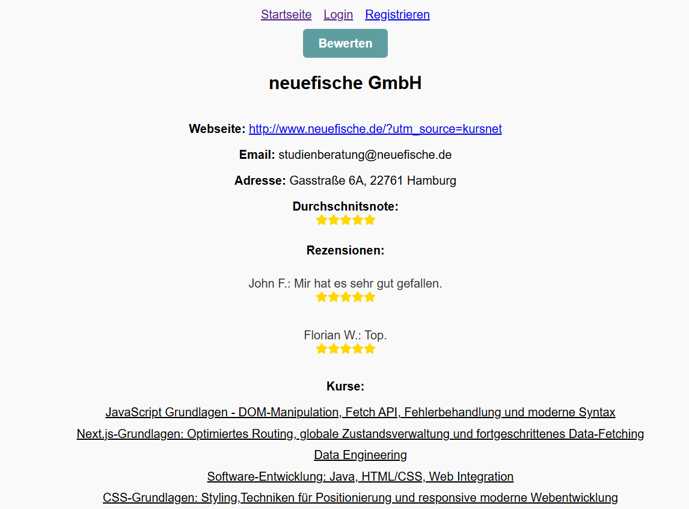

# Weiterbildungsfinder

Dieses Repository enthält ein Projekt für ein Vergleichsportal von Weiterbildungsanbietern.

## Beschreibung

Das Hauptziel des Projekts ist es, den Nutzern die Suche nach einem Weiterbildungsanbieter zu erleichtern, Bewertungen für Kursanbieter zu ermöglichen und alle existierenden Weiterbildungsanbieter in Deutschland aufzulisten.

## Features

Die Anwendung bietet folgende Möglichkeiten:
- **Benutzerregistrierung und -anmeldung** mit Spring Security
- **CRUD-Operationen** für Weiterbildungsanbieter
- **Integration mit externen APIs**, um zusätzliche Daten zu Kursanbietern abzurufen
- Auflistung von über **200 Weiterbildungsanbietern**
- **Suchfunktion** nach Name des Kursanbieters
- Möglichkeit, eine **Rezension zu hinterlassen**, inklusive Sternebewertung und Kommentar
- Moderne **Benutzeroberfläche mit React**, inklusive eines responsiven Designs

## Technologie-Stack

### Backend
- Java (Spring Boot, Spring Security)
- MongoDB mit MongoRepository
- Docker für Containerisierung
- RESTful APIs

### Frontend
- React
- TypeScript
- Axios für API-Aufrufe
- HTML/CSS3

### Testing
- JUnit 5
- Mockito
- **Flapdoodle** für eingebettete MongoDB in Tests

### Weitere Technologien
- SonarCloud

## Deployment

Das Projekt ist unter folgender URL verfügbar: [https://kursda.onrender.com/](https://kursda.onrender.com/).

**Hinweis:** Die Seite könnte etwas länger zum Laden brauchen. Bitte haben Sie Geduld.

## Projekt-Setup

### Voraussetzungen
Stelle sicher, dass du folgende Software installiert hast:
- **Java 17+** für das Backend
- **Node.js 16+** für das Frontend
- **Docker** und **Docker Compose**
- **MongoDB** (lokal oder als Cloud-Dienst, z.B. Render)

## Installation

### 1. Klone das Repository
```bash
git clone https://github.com/Gula1507/weiterbildungsfinder.git
cd weiterbildungsfinder
```

### 2. Backend starten
Navigiere ins Backend-Verzeichnis und starte die Spring Boot-Anwendung:

```bash
cd backend
./mvnw spring-boot:run
```

### 3. Frontend starten
Navigiere ins Frontend-Verzeichnis, installiere die Abhängigkeiten und starte die Anwendung:

```bash
cd frontend
npm install
npm start
```
### Konfiguration
Um Umgebungsvariablen zu setzen, erstelle eine .env-Datei im Verzeichnis backend und füge folgende Werte hinzu:

```bash
SPRING_MONGODB_URI=mongodb://localhost:27017/deine-datenbank
```


### Screenshots
Screenshot der Startseite:


Screenshot der Detailseite für Kursanbieter:


### Geplante Verbesserungen
- Erweiterung der Filter- und Suchfunktion für Kursanbieter
- Erweiterte Login/Logout-Funktionalität
- CRUD-Operationen für Kurse
- Einloggen mit LinkedIn

### Lizenz

Dieses Projekt steht unter der MIT-Lizenz mit einer Klausel für nicht-kommerzielle Nutzung. Siehe [LICENSE-Datei](./LICENSE) für Details.